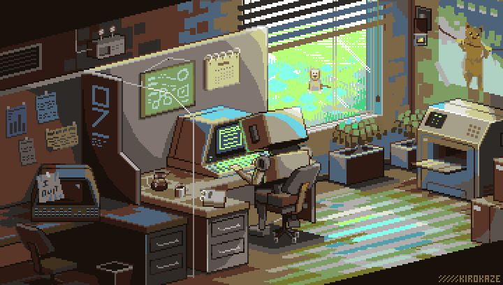

  

<h1 align="center">Hi, I'm Sami Alshami  </h1>

  <strong>Software Engineer · Frontend Developer</strong> 
  React • Next.js • TypeScript

<h3 align="center">
  Connect with me 
  
</h3>

  

---

## 🚀 About Me

Software Engineer with **2+ years** of hands-on experience building production-ready web applications. Delivered **20+ projects** for clients across Oman, Saudi Arabia, Kenya, and Yemen — specializing in **React, Next.js, and TypeScript**.

- 🏆 Consistently achieved **90+ Lighthouse scores** across production applications
- ⚡ Improved web performance achieving up to **40% faster load times**
- 🏗️ Built scalable UI architectures that reduced development effort by **30%**
- 🌍 Delivered solutions for international clients across **4 countries**
- 📚 Currently expanding into **full-stack development** and backend systems

---

##  Technical Skills

### Frontend Development

### Backend & APIs

### Databases

### Performance & Architecture
`SSR` `CSR` `PWA` `Core Web Vitals` `SEO Optimization` `Code Splitting` `Lazy Loading` `Caching Strategies`

### Other Languages & Tools

  
  &nbsp;
  

---

## 🔥 Selected Projects

### [🏢 Mustajer – Rental Platform · *Oman*](https://mustajer.net/)
> **Next.js · TypeScript · Tailwind CSS · React Query · shadcn/ui**

Scalable rental marketplace with 50+ dynamic pages, multilingual support (AR/EN), and a complete reusable design system.
- Implemented SSR & CSR strategies for performance and SEO
- Applied structured SEO (metadata, schema markup, sitemap)
- Built fully responsive interface across all devices

---

### [🌸 Rosa-ke – E-Commerce · *Kenya*](https://rosa-ke.com/)
> **Next.js · TypeScript · Tailwind CSS · React Query**

Full e-commerce frontend with product search, filtering, cart, and payment API integration.
- Optimized performance via caching and lazy loading
- Integrated third-party payment and product APIs
- Delivered user-friendly, responsive UI

---

### [🧼 Clean Touch – Corporate Website · *Saudi Arabia*](https://cleantouch.com.sa/)
> **Next.js · TypeScript · Tailwind CSS**

Corporate services and blog platform with contact form validation and optimized SEO.
- Improved Lighthouse performance scores significantly
- Built scalable and maintainable component architecture

---

### [🛠 Tyseir – Marketplace · *Yemen*](https://tyseir-test-v1.vercel.app/home)
> **Next.js · TypeScript · Tailwind CSS**

Multi-category marketplace with advanced filtering, multilingual support (AR/EN), and scalable navigation.
- Improved SEO structure and metadata handling
- Designed scalable product and category system

---

### 🎓 AI Multimedia Extraction – Graduation Project
> **Python · React · REST APIs · AI**

System for processing videos, audio, PDFs, and documents with structured data extraction pipelines.
- Designed and built the full frontend UI
- Integrated frontend with AI backend services

---

### [📊 Rental Price Prediction – ML Project](https://github.com/Sami-M99/Samsun-Istanbul-Predicting-Rental-Prices)
> **Python · scikit-learn · Pandas**

Machine learning models for real estate price prediction.
- Collected data via web scraping
- Trained and evaluated models based on property features
- Visualized performance metrics

